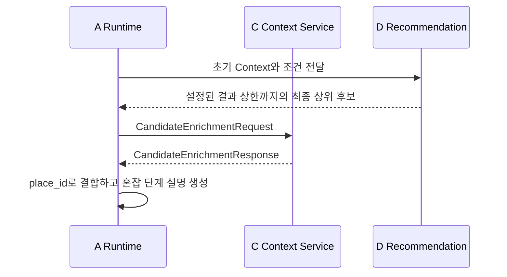

# A ↔ C Context Contract 초안

## 1. 목적

A(Agent Runtime)가 LLM에서 추출한 사용자 조건을 C(Tool Intelligence)에 전달하면,
C가 필요한 내부 Tool과 Provider를 선택해 추천에 필요한 공통 Context를 반환한다.

이 문서는 **협의용 초안**이다. 추천 점수 계산과 사용자용 자연어 응답 생성은 이
계약의 범위가 아니다.

## 2. 책임 경계

| A가 전달하는 것 | C가 결정하는 것 |
| --- | --- |
| 사용자 Intent와 LLM 추출 조건 | 사용할 Tool과 Provider |
| 요청 추적용 `request_id` | API 호출 순서·재시도·정규화 |
|  | Provider 원본 응답을 공통 Context로 변환 |

A는 Provider 이름, API endpoint, API Key, TourAPI 분류 코드, Provider별 원본
필드를 전달하지 않는다. C는 `chat_session_id`를 받거나 저장하지 않는다.

`request_id`는 A가 C 호출마다 생성하는 ID이며, 채팅 세션 ID나 사용자 메시지 ID를
대체하지 않는다.

C는 외부 데이터 조회와 정규화만 담당하며, 이전 노출·거절 후보 제외, 하드 필터,
점수 계산, 최종 추천 개수 결정은 D Recommendation의 책임이다.

## 3. 범위와 확장 원칙

v0는 `RECOMMEND`의 추천 Context 수집만 다룬다. `INFO`와 `COMPARE`는 대상 장소
식별·추천 스냅샷 계약이 추가로 필요하므로 후속 협의 대상으로 둔다.

기존 `tool-intelligence-contract-v1.md`의 `ToolRequest`는 A가 `tool_type`을
선택하는 형식이다. 이 초안은 A가 Tool을 선택하지 않는 상위 A↔C 호출 계약이다.
C 내부에서는 기존 Tool 계약을 계속 사용할 수 있다.

외부 호출 창구는 하나로 유지한다. 이후 Intent가 추가되어도 공통 envelope
(`request_id`, `intent`, `conditions` 또는 Intent별 payload)는 유지하고,
`intent`를 discriminator로 하는 Pydantic union에 요청·응답 모델만 추가한다.

```python
from typing import Annotated

from pydantic import Field


AgentToCRequest = Annotated[
    RecommendContextRequest
    | InfoContextRequest
    | CompareContextRequest,
    Field(discriminator="intent"),
]
```

이 방식은 새 Intent 추가 시 기존 `RECOMMEND` 요청·응답 필드를 바꾸지 않도록 한다.
다만 새 Intent 자체의 payload 모델과 C 처리 로직은 추가해야 한다.

## 4. A → C 요청

### 4.1 스키마

```python
from typing import Literal

from pydantic import BaseModel, Field


class UserConditions(BaseModel):
    current_location: str | None = None
    search_center: str | None = None
    place_types: list[str] = Field(default_factory=list)
    place_tags: list[str] = Field(default_factory=list)
    weather: Literal["rain", "snow", "hot", "cold", "good"] | None = None
    weather_intent: Literal["AVOID", "ENJOY", "IGNORE"] | None = None
    transport: Literal["walk", "public", "car"] | None = None
    max_travel_time: int | None = None
    time_available: int | None = None
    environment: Literal["indoor", "outdoor", "any"] | None = None
    companion: Literal["solo", "couple", "friend", "parent", "child", "pet"] | None = None
    budget: str | None = None
    exclude_tags: list[str] = Field(default_factory=list)
    special_requirements: list[str] = Field(default_factory=list)


class AgentContextRequest(BaseModel):
    request_id: str
    intent: Literal["RECOMMEND"]
    conditions: UserConditions
```

### 4.2 필드 설명

| 필드 | 필수 | 설명 |
| --- | --- | --- |
| `request_id` | 예 | A가 호출 1건마다 생성하는 추적 ID. 응답에 그대로 반환된다. |
| `intent` | 예 | v0에서는 항상 `RECOMMEND`. C가 필요한 Context 수집 흐름을 선택하는 기준이다. |
| `conditions` | 예 | LLM이 추출한 사용자 조건. A는 값을 임의로 Provider 형식으로 변환하지 않는다. |
| `current_location` | 아니오 | 사용자가 말한 현재 위치. |
| `search_center` | 아니오 | 추천 검색 중심 장소. |
| `place_types`, `place_tags` | 아니오 | 사용자가 원하는 장소 유형·태그. C가 내부 분류 코드로 변환한다. |
| 나머지 조건 | 아니오 | 날씨 선호, 이동, 시간, 환경, 동행, 예산 등 추천 판단에 필요한 사용자 조건. |

### 4.3 요청 예시

```json
{
  "request_id": "req_01JABC",
  "intent": "RECOMMEND",
  "conditions": {
    "current_location": "경복궁",
    "search_center": null,
    "place_types": ["restaurant"],
    "place_tags": ["카페"],
    "weather": null,
    "weather_intent": "AVOID",
    "transport": "walk",
    "max_travel_time": 20,
    "time_available": 120,
    "environment": "indoor",
    "companion": "friend",
    "budget": null,
    "exclude_tags": [],
    "special_requirements": []
  }
}
```

### 4.4 요청 결측 규칙

- 사용자가 언급하지 않은 단일 조건은 `null`을 허용한다.
- 복수 조건은 빈 배열 `[]`을 허용한다.
- 빈 문자열과 공백 문자열은 허용하지 않는다.
- `current_location`과 `search_center`가 모두 `null`이면 요청 형식 오류가 아니라,
  C가 `needs_clarification`으로 반환한다.

## 5. C → A 응답

### 5.1 스키마

```python
from __future__ import annotations

from datetime import datetime
from typing import Generic, Literal, TypeVar

from pydantic import BaseModel, Field

class AgentContextResponse(BaseModel):
    request_id: str
    intent: Literal["RECOMMEND"]
    contract_version: Literal["draft-v0"]
    status: Literal[
        "success", "partial", "no_data", "needs_clarification", "unsupported", "unavailable"
    ]
    context: RecommendationContext | None = None
    clarification: Clarification | None = None
    warnings: list[Warning] = Field(default_factory=list)
    error: ContextError | None = None
    metadata: ResponseMetadata


class Coordinates(BaseModel):
    latitude: float
    longitude: float


class ProviderMetadata(BaseModel):
    source: str
    status: Literal["success", "no_data", "unavailable"]
    retrieved_at: datetime


class Warning(BaseModel):
    code: str
    message: str


class ContextError(BaseModel):
    code: str
    message: str
    retryable: bool


class Clarification(BaseModel):
    code: Literal[
        "location_required",
        "location_ambiguous",
        "place_required",
        "place_ambiguous",
    ]
    missing_fields: list[str] = Field(default_factory=list)
    candidates: list[str] = Field(default_factory=list)


class ResolvedLocation(BaseModel):
    requested_query: str
    resolved_name: str
    location: Coordinates
    address: str | None = None


class WeatherForecast(BaseModel):
    condition: Literal["good", "neutral", "bad"]
    forecast_for: datetime
    temperature_celsius: float | None = None


class PlaceCandidate(BaseModel):
    place_id: str
    name: str
    category: str
    location: Coordinates
    operating_hours_raw: str | None = None
    rest_date_raw: str | None = None
    operating_schedule: dict[str, object] | None = None


class HolidayInfo(BaseModel):
    date: str
    name: str


T = TypeVar("T")


class ContextValue(BaseModel, Generic[T]):
    status: Literal["success", "no_data", "partial", "unsupported", "unavailable"]
    data: T | None = None
    error: ContextError | None = None
    warnings: list[Warning] = Field(default_factory=list)
    provider_metadata: list[ProviderMetadata] = Field(default_factory=list)


class RecommendationContext(BaseModel):
    location: ContextValue[ResolvedLocation] | None = None
    weather: ContextValue[WeatherForecast] | None = None
    places: ContextValue[list[PlaceCandidate]] | None = None
    holidays: ContextValue[list[HolidayInfo]] | None = None


class ResponseMetadata(BaseModel):
    rule_versions: dict[str, str] = Field(default_factory=dict)
    provider_metadata: list[ProviderMetadata] = Field(default_factory=list)


```

### 5.2 Context 데이터 개요

| Context | C가 반환하는 내용 | D Recommendation의 사용 예 |
| --- | --- | --- |
| `location` | 해석된 장소명·좌표·주소 | 검색 중심과 거리 계산 기준 |
| `weather` | `good`/`neutral`/`bad` 예보와 예보 시각 | 날씨 Feature 계산 |
| `places` | 후보 장소, 좌표, 분류, 원본·정규화 운영정보 | Candidate 생성·운영시간·거리 계산 |
| `holidays` | 해당 시점의 공휴일 정보 | 후속 운영 판단 보조. v0 점수 반영은 TBD |

`concentration`은 C가 초기 후보 Context만 수집하는 v0 응답에는 포함하지 않는다.
D가 1차 점수 계산 후 상위 후보와 필요한 보강 Feature를 선언하면, A가 이를 중계해
C에 별도 후보 보강 요청을 보낸다. D는 C를 직접 호출하지 않는다.

후보 보강 계약은 초기 Context 계약과 분리된
`CandidateEnrichmentRequest`/`CandidateEnrichmentResponse`를 사용한다. 요청은
D가 선정하고 A가 중계한 후보를 `RECOMMENDATION_RESULT_LIMIT`만큼 받으며
(기본 5개, 시스템 절대 상한 20개), v1 지원 Feature는
`concentration` 하나다. C는 요청 순서를 유지하고 후보별
`success`/`no_data`/`unavailable`과 Provider metadata를 반환한다. 일부 후보만
성공하거나 실패하면 전체 상태는 `partial`이며, 실패 후보도 목록에서 제거하지 않는다.

방문일을 별도로 받지 않는 v1에서는 C가 집중률 API를 호출한 시점의 한국 날짜를
기준일로 사용한다. 여러 날짜가 반환되더라도 오늘 날짜와 일치하는 유효한 값만
`YYYY-MM-DD` 형식으로 정규화해 최대 한 건짜리 `concentration` 목록으로 반환한다.
오늘 값이 없으면 미래나 과거 값으로 대체하지 않고 후보 상태를 `no_data`로 반환한다.

오늘 집중률에는 원본 상대 비율과 정규화된 단계·표시명을 함께 포함한다.
임계값과 단계 정의는 C의 `app/concentration_policy.py`를 단일 기준으로 사용한다.

| 집중률 범위 | `concentration_level` | `concentration_label` |
| --- | --- | --- |
| 50% 이하 | `relaxed` | 여유 |
| 50% 초과 75% 이하 | `normal` | 보통 |
| 75% 초과 100% 이하 | `slightly_crowded` | 약간 붐빔 |
| 100% 초과 | `crowded` | 붐빔 |

음수·무한대·숫자 변환 불가 값은 `no_data`로 처리한다. 이 단계는 사용자 설명을 위한
정규화이며 추천 점수를 다시 계산하거나 후보 순서를 변경하지 않는다.

#### 5.2.1 A → C 후보 보강 재요청

D는 1차 점수 계산 후 보강할 상위 후보를 `RECOMMENDATION_RESULT_LIMIT`까지 A에
반환한다. A는 Provider나 지역 코드를 선택하지 않고 후보 식별정보와 필요한
Feature만 C에 전달한다.

```python
from app.agent_context.enrichment_schemas import (
    CandidateEnrichmentRequest,
    CandidateEnrichmentTarget,
)


enrichment_request = CandidateEnrichmentRequest(
    request_id=new_trace_id(),
    candidates=[
        CandidateEnrichmentTarget(
            place_id=candidate.place_id,
            name=candidate.name,
            latitude=candidate.latitude,
            longitude=candidate.longitude,
        )
        for candidate in top_candidates[:5]
    ],
    features=["concentration"],
)

enrichment_response = await enrichment_provider.enrich(enrichment_request)
```

```json
{
  "request_id": "enrich-01",
  "candidates": [
    {
      "place_id": "126508",
      "name": "경복궁",
      "latitude": 37.5796,
      "longitude": 126.977
    },
    {
      "place_id": "125759",
      "name": "창덕궁",
      "latitude": 37.5794,
      "longitude": 126.991
    }
  ],
  "features": ["concentration"]
}
```

`request_id`는 A가 재요청마다 새로 생성한다. 초기 Context 요청 ID 또는 추천 실행
ID와 로그에서 연관 지을 수는 있지만 같은 값일 필요는 없다. `features`는 v1에서
`["concentration"]`만 허용한다.

#### 5.2.2 C → A 후보 보강 응답

```json
{
  "request_id": "enrich-01",
  "status": "partial",
  "candidates": [
    {
      "place_id": "126508",
      "name": "경복궁",
      "latitude": 37.5796,
      "longitude": 126.977,
      "status": "success",
      "concentration": [
        {
          "place_name": "경복궁",
          "forecast_date": "2026-07-28",
          "concentration_rate": 42.0,
          "concentration_level": "relaxed",
          "concentration_label": "여유"
        }
      ],
      "error": null,
      "provider_metadata": [
        {
          "source": "tour_api_concentration",
          "status": "success",
          "retrieved_at": "2026-07-28T10:00:00+09:00"
        }
      ]
    },
    {
      "place_id": "125759",
      "name": "창덕궁",
      "latitude": 37.5794,
      "longitude": 126.991,
      "status": "no_data",
      "concentration": [],
      "error": null,
      "provider_metadata": [
        {
          "source": "tour_api_concentration",
          "status": "no_data",
          "retrieved_at": "2026-07-28T10:00:00+09:00"
        }
      ]
    }
  ]
}
```

전체 상태는 후보별 상태를 다음 규칙으로 집계한다.

| 후보별 상태 조합 | 전체 상태 |
| --- | --- |
| 모두 `success` | `success` |
| 모두 `no_data` | `no_data` |
| 모두 `unavailable` | `unavailable` |
| 서로 다른 상태가 혼합됨 | `partial` |

`no_data`와 `unavailable`은 후보 제외 사유가 아니다. C는 후보 순서를 변경하거나
추천 결과를 제거하지 않는다.

#### 5.2.3 A의 보강 응답 사용 범위

A는 C 응답을 추천 조건으로 재해석하거나 후보 순서를 변경하지 않는다. 기존 추천
후보와 보강 결과를 안정적으로 결합할 수 있도록 최소한 다음 필드를 보존한다.

| 필드 | A의 사용 목적 | 필수 여부 |
| --- | --- | --- |
| 응답 `status` | 보강 전체 성공·부분 성공·실패 판단 | 필수 |
| `candidate.place_id` | 기존 Scoring 후보와 결합하는 기준 키 | 필수 |
| `candidate.status` | 해당 후보의 집중률 사용 가능 여부 판단 | 필수 |
| `concentration[].forecast_date` | 집중률 예측 기준일 표시 | 데이터가 있을 때 필수 |
| `concentration[].concentration_rate` | 원본 상대 집중률 근거 | 데이터가 있을 때 필수 |
| `concentration[].concentration_level` | 정규화된 혼잡 단계 | 데이터가 있을 때 필수 |
| `concentration[].concentration_label` | 사용자 표시용 한글 단계 | 데이터가 있을 때 필수 |
| `error` | 장애 원인·재시도 판단 | `unavailable`일 때 필수 |
| `provider_metadata` | 출처·상태·조회 시각 추적 및 Snapshot | 보존 필수 |
| `name`, `latitude`, `longitude` | 디버깅·응답 검증용 원본 후보 정보 | 보존 권장 |

A는 `place_id`로 기존 상위 추천 후보와 결합하고 `status=success`인 후보의 정규화된
단계를 최종 설명에 사용한다. 집중률은 추천 점수를 다시 계산하거나 순위를 변경하지
않는다. `no_data`나 `unavailable`인 후보도 기존 점수와 추천 자격을 유지한다.
`provider_metadata`는 점수값은 아니지만 추천 근거와 당시 외부 데이터 Snapshot을
재현하기 위해 삭제하지 않는다.



현재 저장소에는 C의 요청·응답 Schema, Service, Tool·Provider 및 Factory까지
구현되어 있다. A가 D의 최종 후보를 C 요청으로 변환하고 보강 응답을 최종 사용자
응답에 결합하는 배선은 A 영역의 후속 작업이다.

초기 Context의 Tool 선택은 C의 `context-tool-plan-v1` Rule이 담당한다. 위치,
장소, 공휴일은 추천 Context에 필요한 기본 Tool이며, `weather_intent=IGNORE`이면
Weather 호출을 생략한다. 의도적으로 생략한 Tool은 실패나 부분 성공으로 계산하지
않는다.

후보 조회 과정에서 C는 위치·반경·장소 유형처럼 Provider 요청에 필요한 **조회 조건**을
사용할 수 있다. 다만 이전 노출·거절 ID를 기준으로 후보를 제거하거나 최종 후보를
선정하는 **추천 필터**는 적용하지 않는다.

요청의 `conditions.weather`는 사용자가 언급한 5종 날씨 조건(`rain`, `snow`,
`hot`, `cold`, `good`)이고, 응답의 `weather.condition`은 C가 Provider 결과를
정규화한 3종 날씨(`good`, `neutral`, `bad`)다. 두 값은 역할이 다르므로 서로
직접 대입하지 않는다.

### 5.3 응답 예시

```json
{
  "request_id": "req_01JABC",
  "intent": "RECOMMEND",
  "contract_version": "draft-v0",
  "status": "partial",
  "context": {
    "location": {
      "status": "success",
      "data": {
        "requested_query": "경복궁",
        "resolved_name": "경복궁",
        "location": { "latitude": 37.5796, "longitude": 126.977 },
        "address": "서울특별시 종로구"
      },
      "error": null,
      "warnings": [],
      "provider_metadata": []
    },
    "weather": {
      "status": "unavailable",
      "data": null,
      "error": {
        "code": "weather_unavailable",
        "message": "날씨 정보를 가져오지 못했습니다.",
        "retryable": true
      },
      "warnings": [],
      "provider_metadata": []
    },
    "places": {
      "status": "success",
      "data": [
        {
          "place_id": "126508",
          "name": "예시 카페",
          "category": "restaurant",
          "location": { "latitude": 37.58, "longitude": 126.978 },
          "operating_hours_raw": "09:00~22:00",
          "rest_date_raw": null,
          "operating_schedule": {
            "availability": "open",
            "time_ranges": [{ "open_time": "09:00", "close_time": "22:00" }]
          }
        }
      ],
      "error": null,
      "warnings": [],
      "provider_metadata": []
    },
    "holidays": {
      "status": "no_data",
      "data": [],
      "error": null,
      "warnings": [],
      "provider_metadata": []
    }
  },
  "warnings": [
    {
      "code": "weather_missing",
      "message": "날씨 정보 없이 추천을 계속할 수 있습니다."
    }
  ],
  "error": null,
  "metadata": {
    "rule_versions": {
      "category_mapping": "v1",
      "operating_hours_normalization": "v1"
    },
    "provider_metadata": []
  }
}
```

### 5.4 응답 상태·결측 규칙

| 상태 | `context` / `data` 처리 | A/D 후속 처리 |
| --- | --- | --- |
| `success` | 필요한 핵심 Context와 `data`가 존재 | Candidate 생성·추천 진행 |
| `partial` | 일부 Context 또는 내부 필드가 결측 | 가능한 데이터로 추천 진행, 경고 표시 |
| `no_data` | 목록형 데이터는 `[]`, 단건형은 `null` | 후보 없음 안내 또는 조건 완화 요청 |
| `needs_clarification` | `context: null` | A가 사용자에게 필요한 조건 재질문 |
| `unsupported` | `context: null` | MVP 지원 범위 밖 안내 |
| `unavailable` | `context: null` 또는 실패 Context만 존재 | 재시도 또는 일시 오류 안내 |

Provider 원본의 빈 문자열, 공백 문자열, 누락 값은 C에서 `null` 또는 `[]`으로
정규화한다. `success`인 Context는 `data`가 반드시 존재해야 한다.

### 5.5 사용자 재질문

`needs_clarification`은 외부 연동 오류가 아니라 입력이 부족하거나 모호한 상태다.
C는 `clarification`에 기계가 해석할 수 있는 사유 코드와 필요한 필드만 넣고,
사용자에게 보여줄 자연어 재질문은 A가 대화 맥락에 맞춰 생성한다. 이 상태에서는
`error`를 `null`로 둔다.

```json
{
  "request_id": "req_01JABC",
  "intent": "RECOMMEND",
  "contract_version": "draft-v0",
  "status": "needs_clarification",
  "context": null,
  "clarification": {
    "code": "location_required",
    "missing_fields": ["current_location", "search_center"],
    "candidates": []
  },
  "warnings": [],
  "error": null,
  "metadata": { "rule_versions": {}, "provider_metadata": [] }
}
```

## 6. 메타데이터

| 필드 | 설명 |
| --- | --- |
| `contract_version` | A가 응답 구조를 해석하기 위한 계약 버전. 응답 최상위에 둔다. |
| `provider_metadata[].source` | 데이터를 제공한 Provider 식별값. |
| `provider_metadata[].status` | 해당 Provider 호출 결과 상태. |
| `provider_metadata[].retrieved_at` | 외부 데이터를 실제 조회한 시각. timezone을 포함한 ISO 8601 값이다. |
| `metadata.rule_versions` | 분류 매핑·운영시간 정규화처럼 결과에 영향을 준 C 규칙의 버전. |

추천 가중치나 Scoring 규칙 버전은 D Recommendation의 책임이므로 이 응답에 넣지
않는다.

## 7. 협의 필요 항목

1. `INFO`, `COMPARE`를 이 상위 Context 계약에 포함할 시점과 별도 payload 형태
