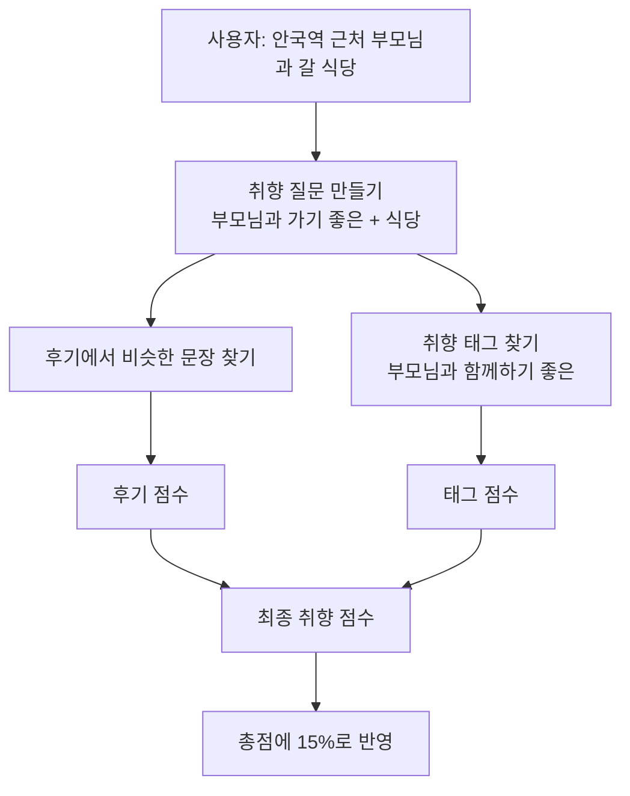

# 취향 점수 계산 방식 결정 기록 (2026-09-17)

> **이 문서는 스코어링 고도화 슬라이드 작성을 위해 기록합니다.**
> 추천에서 "사용자 취향에 얼마나 맞는지"를 점수로 매기는 방법을 어떻게 고쳤고, 왜 그렇게 정했는지를 쉬운 말로 정리했습니다.

---

## 0. 세 줄 요약

1. 취향 점수는 **후기 문장이 질문과 얼마나 비슷한지**와 **취향 태그가 얼마나 붙어 있는지**를 합쳐서 만듭니다.
2. 이번에 후기 쪽 점수 매기는 방법을 세 군데 고쳤습니다.
   - 근거 문장이 1개뿐인 곳이 유리하던 문제 → **항상 근거 3칸의 평균으로 계산**
   - "아주 좋은 카페입니다." 같은 짧은 칭찬이 1위를 하던 문제 → **20자 미만 문장은 근거에서 빼기**
   - 만점 기준을 **0.65 고정 → 이번 후보 중 1등 기준(단, 0.60 아래로는 내리지 않음)**
3. 그 결과 추천 5곳의 정답률이 **88.1% → 90.0%** 로 올랐습니다(질문 16개 × 동네 2곳 = 32번 측정).

---

## 1. 먼저 알아야 할 말들

| 말 | 쉬운 뜻 |
| --- | --- |
| **유사도** | 두 문장이 **뜻이 얼마나 비슷한지**를 나타내는 숫자. 클수록 비슷함. 우리 데이터에서는 보통 0.43–0.8 사이 |
| **근거 문장** | 한 장소의 블로그·구글 후기 중, 사용자 취향 질문과 가장 비슷한 문장. 장소마다 최대 3개 |
| **장소 유사도** | 그 장소의 근거 문장 3개의 평균 유사도 |
| **0점 기준(0.43)** | "겨우 관련 있다"의 기준선. 이보다 낮은 문장은 근거로 쓰지 않음 |
| **만점 기준** | 장소 유사도가 이 값 이상이면 후기 점수 만점(1.00)을 줌 |
| **1등 유사도** | 이번 추천 요청의 후보 장소들 중 가장 높은 장소 유사도 |
| **바닥값** | 만점 기준이 내려갈 수 있는 **가장 낮은 값**. 지금 0.60 |
| **후기 점수** | 장소 유사도를 0–1점으로 바꾼 값 |
| **태그 점수** | 취향 태그(예: "부모님과 함께하기 좋은")가 얼마나 많이 붙었는지를 0–1점으로 바꾼 값 |
| **최종 취향 점수** | 후기 점수와 태그 점수를 합친 값 |
| **총점** | 날씨·영업시간·거리·최종 취향 점수를 합친 추천 순위 점수 |

---

## 2. 취향 점수가 추천 순위에 들어가기까지



**총점 계산식** (사용자가 취향을 말한 요청)

```
총점 = 0.35 × 날씨 점수
     + 0.35 × 남은 영업시간 점수
     + 0.15 × 거리 점수
     + 0.15 × 최종 취향 점수
```

- 취향을 말하지 않은 요청은 취향 칸 없이 날씨 0.40, 남은 영업시간 0.40, 거리 0.20을 씁니다.
- 근거가 하나도 없는 장소는 취향 점수 0점입니다. 깎이는 건 없고, 취향 몫 15%를 못 받을 뿐입니다.

---

## 3. 장소 유사도를 후기 점수로 바꾸는 식

유사도는 0.43–0.8 근처에 몰려 있어서 그대로 쓰면 차이가 잘 안 보입니다. 그래서 **0.43을 0점, 만점 기준을 1점**으로 두고 그 사이를 0–1점으로 늘립니다.

```
후기 점수 = (장소 유사도 − 0.43) ÷ (만점 기준 − 0.43)
  - 계산 결과가 0보다 작으면 0점
  - 1보다 크면 1점
```

**자로 비유하면:** 0.43 눈금을 0점, 만점 기준 눈금을 100점으로 맞춘 자입니다. 내 장소 유사도가 이 자의 어디쯤인지 읽는 것입니다.

### 예전에는 만점 기준이 0.65로 고정이었습니다

- **왜 1.0이 아니라 0.65였나?** 실제 후기 유사도는 가장 높아도 0.8 정도라서, 1.0을 만점으로 두면 1등 후보도 평균 0.22점밖에 못 받았습니다. 그러면 취향 점수가 날씨·거리 점수에 묻힙니다.
- **왜 0.65였나?** 2026-08-19에 측정한 1등 유사도 32건 중 26건이 0.65보다 낮았습니다. 그래서 "대부분 요청에서 1등이 만점 근처가 되는 값"으로 0.65를 골랐습니다.

### 0.65 고정의 두 가지 문제

**문제 1 — 잘 맞는 날, 상위권이 모두 동점**

"안국역 부모님과 가기 좋은 식당"에서 양반댁(0.699), 뉘조(0.694), 만리지화(0.684)가 **모두 1.00점**이었습니다. 부모님 태그가 21건인 곳과 3건인 곳이 같은 점수가 되고, 이미 만점이라 태그 점수가 더해질 틈도 없었습니다.

**문제 2 — 약하게 맞는 날, 취향이 거의 무시됨**

질문이 후기와 잘 안 맞는 날(1등 유사도가 0.57 정도)은 모든 장소의 후기 점수가 낮게 뭉칩니다. 그러면 취향 차이가 총점에 거의 안 나타나고, **근거가 전혀 없는 곳이 가깝다는 이유만으로** 추천 5곳에 들어옵니다.

- 예: 성동구 "조용히 쉬기 좋은 장소"에서, 근거 문장이 "평상위치는 1번-19번… 풀장이 가까워서"인 살곶이체육공원이 5곳 안에 들어왔습니다.

---

## 4. 바꾼 것 첫째 — 근거는 항상 3칸 평균

```
장소 유사도 = (근거 문장 1 유사도 + 근거 문장 2 유사도 + 근거 문장 3 유사도) ÷ 3
  - 근거가 3개보다 적으면 빈 칸은 0.43(0점 기준)으로 채움
```

**왜?** 예전에는 찾은 문장끼리만 평균을 냈습니다. 그래서 **좋은 문장 1개만 있는 곳**이 **괜찮은 문장 3개가 있는 곳**보다 유리했습니다.

| 장소 ("카공하기 좋은 카페") | 근거 문장 | 예전 장소 유사도 | 바뀐 장소 유사도 |
| --- | --- | --- | --- |
| 산1-1 | "전망 좋은 정말 멋진 카페!" 1개 (0.648) | 0.648 → **1위** | (0.648 + 0.43 + 0.43) ÷ 3 = **0.503** |
| 스태픽스 | 3개 (0.674, 0.607, 0.593) | 0.625 | 0.625 (그대로) |

여러 후기에서 반복해서 칭찬받은 곳이 위로 올라가게 한 것입니다.

---

## 5. 바꾼 것 둘째 — 20자 미만 짧은 문장은 근거에서 빼기

**왜?** "아주 좋은 카페입니다." 같은 짧은 칭찬은 "카공"과 관계없는데도 질문 속 "좋은 카페"와 겹쳐서 유사도가 높게 나옵니다. "카공하기 좋은 카페" 1위·2위의 근거가 둘 다 이런 문장이었습니다.

**어떻게?** 장소마다 문장을 10개 받아 온 뒤 20자 미만(앞뒤 공백 제외)을 빼고, 남은 것 중 유사도가 높은 3개를 씁니다.

**대가:** "혼자 조용히 있기 좋았다"처럼 짧지만 맞는 문장도 빠집니다. 20자는 한 값만 재 봐서 조정할 여지가 있습니다.

### 첫째·둘째 변경의 측정 결과 (취향 점수만으로 순위를 매겼을 때)

| 방식 | 정답셋 nDCG@5 | 정답셋 Strict P@5 | 안국역 카공 nDCG@5(참고) |
| --- | --- | --- | --- |
| 예전 | 0.926 | 0.900 | 0.22 |
| 3칸 평균만 | 0.938 | 0.925 | 0.27 |
| 20자 제외만 | 0.926 | 0.900 | 0.41 |
| **둘 다** | **0.938** | **0.925** | **0.41** |

- **nDCG@5:** 상위 5곳에 정답이 많고, 확실한 정답이 위쪽에 있을수록 1에 가까워지는 순위 품질 점수입니다.
- **Strict P@5:** 상위 5곳 중 "확실히 맞음" 등급 장소의 비율입니다.
- 정답셋은 용산·성동 55곳 × 질문 16개입니다. 나빠진 질문은 없었고, 20자 제외는 정답셋 순위를 하나도 바꾸지 않았습니다.
- 안국역 카공은 정답이 없어서, 후기에 "카공·노트북·콘센트"가 나온 횟수로 대신 매긴 참고값입니다.

---

## 6. 바꾼 것 셋째 — 만점 기준을 요청마다 정하기

```
만점 기준 = "이번 후보 중 1등 유사도"와 "0.60" 중 더 큰 값
```

한 줄로 말하면 **상대평가인데, 0.60이라는 바닥이 있는 상대평가**입니다.

- **1등 유사도가 0.60 이상인 날:** 1등이 만점이고, 나머지는 1등과 비교해 점수를 받습니다.
- **1등 유사도가 0.60보다 낮은 날:** 만점 기준은 0.60에서 멈춥니다. 그래서 1등도 만점을 못 받습니다. 겨우 조금 맞은 곳이 만점을 받는 것을 막는 장치입니다.

> **주의 — 바닥값은 "유사도 0.60 이상인 장소만 계산한다"는 뜻이 아닙니다.**
> 모든 장소가 같은 식에 들어갑니다. 바닥값은 **만점 기준을 얼마나 낮게 내려도 되는지**만 정합니다.

**비유:** 시험이 어려워 최고점이 57점이면, 57점을 100점으로 올려 주는 상대평가를 하되 "최고점이 60점보다 낮으면 60점을 100점 기준으로 본다"는 규칙을 둔 것입니다.

### 예시 1 — 잘 맞는 날 (1등 유사도 0.70)

만점 기준 = 0.70과 0.60 중 큰 값 = **0.70**

| 장소 유사도 | 예전 (만점 기준 0.65) | 바뀐 방식 (만점 기준 0.70) |
| --- | --- | --- |
| 0.70 (1등) | (0.70 − 0.43) ÷ 0.22 = 1.23 → **1.00** | 0.27 ÷ 0.27 = **1.00** |
| 0.67 | 0.24 ÷ 0.22 = 1.09 → **1.00 (동점)** | 0.24 ÷ 0.27 = **0.89** |
| 0.52 | 0.09 ÷ 0.22 = **0.41** | 0.09 ÷ 0.27 = **0.33** |

→ 동점이 풀립니다(문제 1 해결).

### 예시 2 — 약하게 맞는 날 (1등 유사도 0.57)

만점 기준 = 0.57과 0.60 중 큰 값 = **0.60** (바닥값이 적용됨)

| 장소 유사도 | 예전 (만점 기준 0.65) | 바뀐 방식 (만점 기준 0.60) |
| --- | --- | --- |
| 0.57 (1등) | 0.14 ÷ 0.22 = **0.64** | 0.14 ÷ 0.17 = **0.82** |
| 0.52 | 0.09 ÷ 0.22 = **0.41** | 0.09 ÷ 0.17 = **0.53** |

→ 후기 점수가 커져서 취향이 순위에 반영됩니다(문제 2 해결). 그래도 1등이 1.00까지는 가지 않습니다.

### 함께 비교한 방법

| 방법 | 만점 기준 | 추천 5곳 정답률 |
| --- | --- | --- |
| 예전 | 항상 0.65 | 88.1% |
| 올리기만 | 1등 유사도와 0.65 중 큰 값 — 잘 맞는 날 동점만 풀기 | 88.1% (변화 없음) |
| **채택** | **1등 유사도와 0.60 중 큰 값** — 동점 풀기 + 약한 날 살리기 | **90.0%** |

동점만 푸는 방법은 5곳 안에서 순서만 바뀌고 정답률은 그대로였습니다. **실제 개선은 "약하게 맞는 날 만점 기준을 내린 것"에서 나왔습니다.**

---

## 7. 바닥값을 0.60으로 정한 이유

### 어떻게 쟀나

| 항목 | 내용 |
| --- | --- |
| 질문 | 서로 다른 **16개**. 취향 8가지 × 표현 2가지 (예: "부모님과 함께 가기 좋은 장소" / "어르신을 모시고 방문하기 좋은 곳") |
| 후보 장소 | 정답이 매겨진 55곳을 **용산 후보**와 **성동 후보**로 나눠 각각 추천 → 16 × 2 = **32번** |
| 순위 | 취향만이 아니라 실제 서비스처럼 **날씨·영업시간·거리까지 합친 총점**으로 5곳 선정. 날씨 맑음, 평일 오후 2시로 고정 |
| 정답 | 장소 × 취향마다 미리 매긴 등급: 확실히 맞음 / 약간 맞음 / 관계없음 |
| 정답률(P@5) | 추천 5곳 중 "확실히 맞음" 또는 "약간 맞음"인 곳의 비율 |
| nDCG@5 | 추천 5곳의 순위 품질 점수. 확실한 정답이 위쪽에 있을수록 1에 가까움 |
| 부작용 | 관계없는 곳인데 최종 취향 점수 0.9 이상을 받은 곳의 수 |

### 바닥값별 결과

| 방법 | 정답률(P@5) | nDCG@5 | 5곳 중 관계없는 곳 | 관계없는 곳이 1위 | 부작용 |
| --- | --- | --- | --- | --- | --- |
| 예전 (만점 기준 0.65 고정) | 88.1% | 0.781 | 0.59곳 | 2번 | 1곳 |
| 바닥값 0.50 | 90.6% | 0.811 | 0.47곳 | 1번 | 2곳 |
| 바닥값 0.55 | 90.6% | 0.809 | 0.47곳 | 1번 | 2곳 |
| 바닥값 0.58 | 90.6% | 0.808 | 0.47곳 | 1번 | 2곳 |
| **바닥값 0.60 (채택)** | **90.0%** | **0.804** | **0.50곳** | **1번** | **1곳** |
| 바닥값 0.62 | 88.8% | 0.789 | 0.56곳 | 2번 | 1곳 |
| 반만 내리기: 만점 기준 = (1등 유사도 + 0.65) ÷ 2 | 89.4% | 0.803 | 0.53곳 | 1번 | 1곳 |

**표 읽는 법**
- **0.50–0.58이 똑같은 이유:** 실제 질문들의 1등 유사도가 대부분 0.58 이상이라, 그보다 낮은 바닥값은 쓰일 일이 없었습니다.
- **0.60을 고른 이유:** 0.58 이하보다 정답률은 0.6%p 낮지만, **부작용이 예전과 같은 1곳**으로 유지되는 값 중 정답률이 가장 높았습니다.
- **0.62부터는** 예전 방식과 거의 같아져서 효과가 사라집니다.
- **실제 코드로 다시 측정:** 반영 후 같은 32번을 다시 돌려 정답률 90.0%, nDCG@5 0.804로 같게 나왔습니다.

### 달라진 추천 예시

- **용산 "어르신을 모시고 방문하기 좋은 곳":** 근거 없는 키즈카페 챔피언1250X와 아이스링크(둘 다 관계없음)가 빠지고, 미미옥 "부모님 모시고 가기에도 깔끔한 분위기"와 서해금빛열차 "부모님 효도여행"(둘 다 확실히 맞음)이 들어왔습니다.
- **성동 "조용히 쉬기 좋은 장소":** 살곶이체육공원(약간 맞음)이 빠지고 폴인레미유 "조용한 카페 찾는 분 추천해요"(확실히 맞음)가 들어왔습니다.
- **부작용 예 — 성동 "색다른 경험":** 태그 점수 1.00인 어니언 성수(확실히 맞음)가 빠지고 폴인레미유(약간 맞음)가 들어왔습니다.

(위 예시는 바닥값 0.55로 돌린 시뮬레이션에서 뽑았습니다. 0.60에서는 일부 다를 수 있습니다.)

### 이 근거의 한계 — 꼭 같이 적어야 할 점

- **정답 등급은 사람이 아니라 AI가 판정했습니다.** 440건 모두 AI 검토 상태입니다.
- 질문이 **16개뿐**이고, 이미 임베딩 모델을 고를 때 한 번 쓴 질문들입니다.
- 0.58과 0.60의 차이는 32번 중 **한두 장소**가 바뀐 정도입니다.
- 그래서 "0.65 고정보다 이 방식이 낫다"는 어느 정도 믿을 만하지만, **"바닥값이 꼭 0.60이어야 한다"는 근거는 약합니다.** 코드에서는 값 하나만 바꾸면 되도록 해 두었습니다.

---

## 8. 태그 점수와 합치는 방법

### 태그 점수

```
태그 점수 = 이 장소의 긍정 후기 수 ÷ 이번 후보 중 가장 많은 긍정 후기 수
```

- **어떤 태그?** 발화에서 알아낸 취향입니다. 예: "부모님과" → 부모님과 함께하기 좋은, "혼밥" → 혼자 가기 좋은, "카공" → 공부하기 좋은
- **긍정 후기 수:** 그 취향을 좋게 언급한 **서로 다른 후기·블로그 글 수**입니다. 한 글에서 여러 번 나와도 1건으로 셉니다.
- **왜 비율로?** 장소마다 모인 후기 수가 달라 절대 건수로는 비교가 안 됩니다. 그래서 이번 후보 중 가장 많은 곳을 1.00으로 둡니다.
- **0점인 경우:** 태그가 없거나, 나쁘게 말한 후기가 좋게 말한 후기보다 많을 때입니다. 깎이지는 않습니다.
- **예:** "안국역 부모님과 가기 좋은 식당"에서 가장 많은 곳은 양반댁 21건입니다. 뉘조가 15건이면 태그 점수 = 15 ÷ 21 = **0.71**입니다.

### 최종 취향 점수

```
최종 취향 점수 = 후기 점수 + 0.35 × 태그 점수 × (1 − 후기 점수)
```

풀어서 말하면 이렇습니다.

1. **후기 점수:** 후기 유사도로 이미 받은 점수
2. **(1 − 후기 점수):** 만점까지 **남은 칸**
3. **0.35 × 태그 점수:** 남은 칸 중 태그가 채울 수 있는 비율. 태그가 가장 많아도(태그 점수 1) **남은 칸의 35%까지만** 채웁니다.

**비유:** 컵에 물(후기 점수)이 차 있고, 태그는 **빈 부분의 최대 35%까지만** 더 부을 수 있습니다. 컵이 거의 차 있으면 조금만, 비어 있으면 많이 더해집니다. 컵이 넘치는(1점 초과) 일은 없습니다.

### 개발자 화면 예시 풀이

화면 표시: `0.87 + 0.35 × 0.90 × (1 - 0.87) = 0.91`

| 단계 | 계산 | 값 |
| --- | --- | --- |
| 1. 후기 점수 | — | 0.87 |
| 2. 남은 칸 | 1 − 0.87 | 0.13 |
| 3. 태그가 채울 비율 | 0.35 × 0.90(태그 점수) | 0.315 |
| 4. 태그가 더하는 점수 | 0.315 × 0.13 | 0.041 |
| 5. 최종 취향 점수 | 0.87 + 0.041 | **0.91** |
| 6. 총점에 들어가는 양 | 0.15 × 0.91 | **0.137** |

### 여러 경우 한눈에

| 후기 점수 | 태그 점수 | 최종 취향 점수 | 뜻 |
| --- | --- | --- | --- |
| 0.72 | 0 (태그 없음) | 0.72 | 태그가 없어도 후기 점수는 그대로 |
| 0.72 | 1.00 | 0.82 | 태그가 많으면 반드시 올라감 |
| 0.40 | 1.00 | 0.61 | 후기 점수가 낮을수록 태그가 많이 더함 |
| 0.00 | 1.00 | 0.35 | 태그만 있는 곳의 최대 점수 |
| 1.00 | 1.00 | 1.00 | 1점을 넘지 않음 |

### 왜 이렇게 합쳤나

- **태그만 쓰면 안 됩니다.** 예전에 태그가 있으면 후기 검색을 건너뛰었더니, 태그는 없지만 딱 맞는 후기가 있는 곳이 0점이 됐습니다. 예: 하나로회관은 "부모님을 모시고 가기에도"(유사도 0.778)라는 후기가 있는데 부모님 태그가 없었습니다.
- **그냥 더하면 안 됩니다.** 태그와 후기 유사도는 **같은 후기에서 나온 정보**라, 그대로 더하면 같은 근거를 두 번 세게 됩니다.
- **35%는 아직 정해 둔 첫 값입니다.** 태그만 있는 곳의 점수를 0.35 이하로 묶기 위한 값이고, 따로 측정해서 정한 값은 아닙니다.

---

## 9. 채택하지 않은 방법

| 방법 | 내용 | 안 쓴 이유 |
| --- | --- | --- |
| 태그만으로 채점 | 태그가 있으면 후기 검색 생략 | 태그 없는 곳이 전부 0점, 근거 문장도 사라짐 |
| 만점 기준 올리기만 | 1등 유사도와 0.65 중 큰 값 | 정답률 변화 없음 (88.1%) |
| 바닥값 0.58 이하 | 1등 유사도와 0.50–0.58 중 큰 값 | 정답률 +0.6%p지만 관계없는 곳이 만점 근처를 받는 경우가 1곳 늘어남 |
| 반만 내리기 | (1등 유사도 + 0.65) ÷ 2 | 바닥값 0.60보다 낮음 (89.4%) |

---

## 10. 남은 과제

- [ ] **태그 빈틈 채우기:** 안국역 반경 3km 카페 55곳 중 "공부하기 좋은"·"작업하기 좋은" 태그가 **0곳**입니다. 더소가 카페 서촌은 후기에 "작업하기 좋은·노트북"이 16번 나오는데도 태그가 없습니다. 혼밥 식당 후보 50곳 중 "혼자 가기 좋은" 태그는 3곳뿐입니다.
- [ ] **태그 가산 35% 재조정 — 순서 주의:** 긍정 후기 수 상대점수를 적용하고 태그 빈틈까지 채운 **뒤에** 조정해야 합니다. 지금 35%를 먼저 바꾸면 데이터 누락과 채점식 문제를 가중치로 덮게 됩니다.
- [ ] **"비추" 후기 걸러내기:** "콘센트 이슈로 카공하기엔 비추", "노트북 사용 금지"도 유사도가 높게 나옵니다. 문장 유사도는 좋다/나쁘다를 구분하지 못합니다.
- [ ] **정답을 사람이 검토하기:** 지금은 AI 판정뿐입니다.
- [ ] **새 질문으로 한 번 더 확인:** 이번 16개와 다른 표현의 질문을 새로 만들어 바닥값과 20자 기준을 다시 확인합니다.
- [ ] **20자 기준 다시 재기:** 한 값만 재 봤습니다.
- [ ] **취향 비중 15%와 비교:** 바닥값의 효과는 결국 "약하게 맞는 날 취향 비중 키우기"와 비슷합니다. 취향 가중치를 직접 바꾸는 방법과 같은 표로 비교해 볼 만합니다.

---

## 참고: 코드 위치

| 내용 | 위치 |
| --- | --- |
| 3칸 평균, 만점 기준, 최종 취향 점수 합치기 | `backend/app/domain/scoring.py` |
| 20자 미만 문장 제외 | `backend/app/providers/place_evidence.py` |
| 태그 점수 | `backend/app/domain/scoring.py` |
| 점수 버전 기록 | `docs/scoring-version.md` (이번 변경: 1.11.0) |
| 정답셋 | `backend/test_results/preference_retrieval/` |
